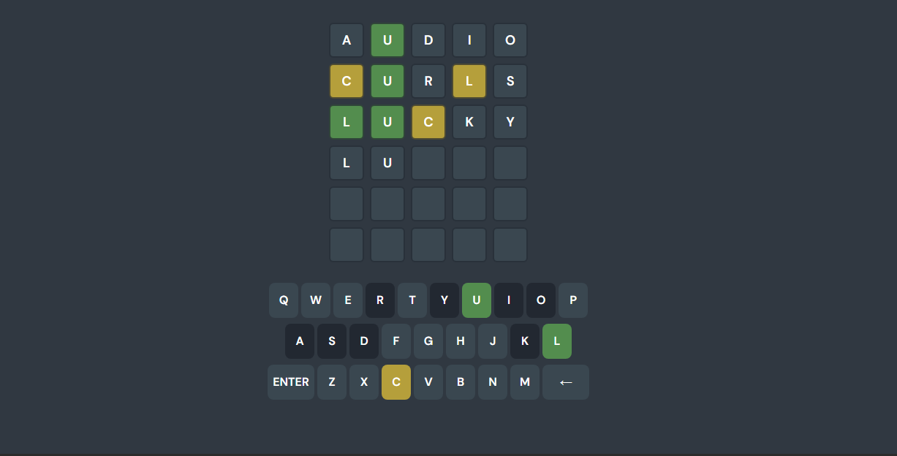

<a id="readme-top"></a>

<!-- WORDLE LOGO -->
<br />
<div align="center">
  <a href="https://github.com/othneildrew/Best-README-Template">
    
  </a>

  <h3 align="center">WORDLE</h3>

  <p align="center">
    Get 6 chances to guess a 5-letter word.
    <br />
  </p>
</div>

<details>
  <summary>Table of Contents</summary>
  <ul>
    <li>
      <a href="#about-the-project">About The Project</a>
      <ul>
        <li><a href="#built-with">Built With</a></li>
      </ul>
    </li>
    <li>
      <a href="#getting-started">Getting Started</a>
      <ul>
        <li><a href="#installation">Installation</a></li>
      </ul>
    </li>
    <li><a href="#challenges">Challenges</a></li>
    <li><a href="#improvements">Improvements</a></li>
    <li><a href="#comments">Comments and Discussions</a></li>
    <li><a href="#contact">Contact</a></li>
  </ul>
</details>

<!-- ABOUT THE PROJECT -->

## About The Project



This project was based on the popular trendy game WORDLE that requires you to guess a daily 5-letter word with limited attempts. The project was created to showcase my technical skills in terms of recreating an already existing project through the use of reverse engineering.

### Built With

The Tech Stack that was used to create this project includes:

- [![Next][Next.js]][Next-url]
- [![React][React.js]][React-url]

## Installation

### Clone the repository:

```bash
git clone https://github.com/marcbensan/marc-wordle.git
cd marc-wordle
```

### Install dependencies using NPM or PNPM:

```bash
npm install
```

### Run the development server locally:

```bash
npm run dev
```

### Open your browser and navigate to:

```bash
http://localhost:3000
```

### (Optional) Run tests to ensure everything is working:

```bash
pnpm test
```

Now you're ready to start working on the project!

# Challenges

During the development of this project, I encountered several challenges that took a bit of time to resolve, debug, and refactor. Below is a detailed breakdown of the key challenges I faced and how I resolved them:

### Mapping the Boxes and Keyboard Keys

Challenge: Designing an architecture to map the game grid (boxes) and keyboard keys was a hard task. It required a clear structure to make sure the boxes and keys were dynamically updated based on user input.

Solution: For the guess boxes, I created a CONSTANT that will hold the value for the maximum amount of guesses and letters per row. I noticed that I was using the number 6 (for the maximum guess) and 5 (for the amount of letters per row) all over some of the components so I decided to create a constant instead to hold the value to reduce redundancy and to have the ability to change it if needed.

I tried various methods of mapping out the keyboard but I ended up sticking with the current method of mapping out the keys in an array to properly match the visual on how the keyboards are mapped on the actual WORDLE game.

### Dynamically changing the grid style based on the CONSTANTS

Challenge: This issue revolved around TailwindCSS. In the `Guess` component, the grid layout has the className `"grid grid-cols-5"` this works fine if the the constant `BOXES_LENGTH` is 5. However if I modify the value to be something else, the box length being rendered will match the value given except the styling. This is because Tailwind doesn't support dynamic class names like `"grid-cols-${BOXES_LENGTH}"` when `BOXES_LENGTH` is a runtime constant.

Solution: I tried many solutions such as using the library `clsx`, adding a `useState` and `useEffect` to spy on the constant's changes, but nothing seemed to work. In the end, I decided to keep it as `"grid-cols-5"` since the game will be running in that setting primarily anyway and also due to time constraint.

### Creating a GitHub Action workflow

Challenge: Creating a GitHub Action that runs specific jobs on push/pull-request is fairly simple, what I had issues with is the fact that I was using PNPM locally but the GHA required NPM.

Solution: I decided to use NPM locally to match the system on GHA. This resolved all of the issues I encountered and now works on push and pull request.

### Handling Keydown Events

Challenge: Listening to keydown events globally to allow users to input letters from anywhere on the page was tricky.

Solution: I added a global event listener for keydown. I also validated the input to ensure only valid keys were processed (no special characters or numbers).

### Connecting to the API

Challenge: Integrating with the API was straightforward, but I had to decide whether to use server actions. Since there were no forms or data mutations, I decided not to use server actions.

Solution: I used the fetch API through a `useEffect()` to send guesses to the backend and handle responses. This approach kept the client-side logic simple.

### Dynamic Box Color Changes with Animations

Challenge: Dynamically changing the background color of the guess boxes with animations was challenging due to delays.

Solution: I used the `framer-motion` library. This ensured that the animations looked nice and did not interfere with the game logic.

### State Management

Challenge: Managing the game state (guesses, results, current guess, game over status) and structuring it in a way that was easy to maintain and extend was a significant challenge.

Solution: I used React's useState hook to manage the state and carefully structured the state updates to ensure they were predictable and easy to debug.

### Handling Guess Box Background Updates

Challenge: Ensuring that the background of the guess boxes did not change until the user submitted their guess. I had to think about how to use flags or conditional logic to manage this behavior.

Solution: I introduced a flag to track whether a guess was submitted and used it to control when the background color changed. This approach ensured the UI behaved as expected.

### Choosing a Color Palette

Challenge: Selecting a color palette that was visually appealing took a while.

Solution: I experimented with different color combinations and settled on a palette that was both aesthetically pleasing and easy to distinguish for users.

### Architecting State and Data Flow

Challenge: Designing how to pass states and data among different components.

Solution: I used a top-down approach, passing state and handlers as props to child components. I initially attempted using state management libraries such as `Jotai` to create stores and atoms that will hold the state of the users' guesses but I decided against it since I realized I could just create another parent component that will pass down the appropriate data to each components that needs it.

### Creating Unit Tests with Vitest

Challenge: Writing unit tests with Vitest was time-consuming, especially when mocking libraries like framer-motion. The animations added delays that interfered with testing, making it difficult to validate the behavior without waiting for animations to complete, or adding static timeouts/delays.

Solution: I mocked framer-motion to bypass animations during testing. This required debugging and ensuring that the mocked components behaved consistently with the actual library. I also had to set a delay statically to compensate for the computing speed of the local system that will run the test.

### Refactoring for Efficiency and Readability

Challenge: As the project grew, some parts of the code became harder to read and maintain. Refactoring was necessary to improve efficiency and make the codebase easier to understand.

Solution: I refactored portions of the code to improve readability.

## Improvements

Here is the list of improvements that could be done to this project:
- Better styling overall especially on the navbar. I could add more options in there just like how it is with the original WORDLE game.
- Features such as Statistics, Hints, Settings and etc.
- Storing current user guesses in local storage. This way, If the user still has some guesses left, they can always return to the app and expect to have their previous guesses to still be present. This will also avoid the issue of users refreshing the page to have more attempts..
- In terms of animation, I can spend more time improving the timing between the box flipping to its color changing. In the original game, the box color doesnt change until that specific box finishes its flipping animation.

## Comments and Discussions

This was an incredibly fun little project to work on, it gave me more opportunities to practice working with animations and unit testing. Some comments that I'd like to share about the project are as follows:

- The `README` provided for instructions stated that one of the attributes returned in the response is `isvalidword` while in reality it's actually `is_valid_word` which is an inconsistency I noticed (unless this is intentional..)
- Having the option to have the right word returned to us would be a nice touch. This way, I will have the ability to inform the user the right word if they fail to guess it in 6 attempts. This will remove the need of having a `Play Again` button just for the users to find out the right word. This could be done by including the right word in the response body or be returned via a separate endpoint.

## Contact

If you have any questions or want to connect, feel free to reach out:

Email: marcbensan.inq@gmail.com
<br />
LinkedIn: https://www.linkedin.com/in/marc-bensan/
<br/>
GitHub: https://github.com/marcbensan

<p align="right">(<a href="#readme-top">back to top</a>)</p>

[Next.js]: https://img.shields.io/badge/next.js-000000?style=for-the-badge&logo=nextdotjs&logoColor=white
[Next-url]: https://nextjs.org/
[React.js]: https://img.shields.io/badge/React-20232A?style=for-the-badge&logo=react&logoColor=61DAFB
[React-url]: https://reactjs.org/
