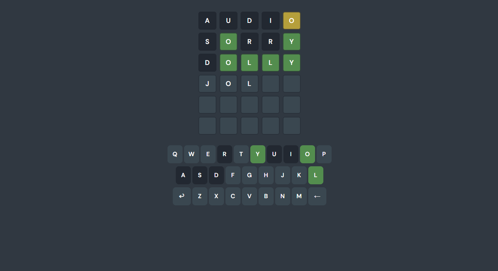

<a id="readme-top"></a>
[![LinkedIn][linkedin-shield]][linkedin-url]

<!-- PROJECT LOGO -->
<br />
<div align="center">
  <a href="https://github.com/othneildrew/Best-README-Template">
    
  </a>

  <h3 align="center">WORDLE</h3>

  <p align="center">
    Get 6 chances to guess a 5-letter word.
    <br />
  </p>
</div>

<details>
  <summary>Table of Contents</summary>
  <ol>
    <li>
      <a href="#about-the-project">About The Project</a>
      <ul>
        <li><a href="#built-with">Built With</a></li>
      </ul>
    </li>
    <li>
      <a href="#getting-started">Getting Started</a>
      <ul>
        <li><a href="#prerequisites">Prerequisites</a></li>
        <li><a href="#installation">Installation</a></li>
      </ul>
    </li>
    <li><a href="#usage">Usage</a></li>
    <li><a href="#roadmap">Roadmap</a></li>
    <li><a href="#contributing">Contributing</a></li>
    <li><a href="#license">License</a></li>
    <li><a href="#contact">Contact</a></li>
    <li><a href="#acknowledgments">Acknowledgments</a></li>
  </ol>
</details>

<!-- ABOUT THE PROJECT -->

## About The Project



This project was based on the popular trendy game WORDLE that requires you to guess a daily 5-letter word with limited attempts.

The project was created to showcase my technical skills in terms of recreating an already existing project through the use of reverse engineering.

### Built With

The Tech Stack that was used to create this project includes:

- [![Next][Next.js]][Next-url]
- [![React][React.js]][React-url]

<!-- GETTING STARTED -->

## Getting Started

Follow these steps to set up and run the project locally:

Prerequisites
Make sure you have the following installed on your system:

Node.js (v16 or higher recommended)
PNPM (v7 or higher)

## Installation

### Clone the repository:

```bash
git clone https://github.com/marcbensan/marc-wordle.git
cd marc-wordle
```

### Install dependencies using PNPM:

```bash
pnpm install
```

### Run the development server locally:

```bash
pnpm run dev
```

### Open your browser and navigate to:

```bash
http://localhost:3000
```

### (Optional) Run tests to ensure everything is working:

```bash
pnpm test
```

Now you're ready to start working on the project!

# Challenges

During the development of this project, I encountered several challenges that took a bit of time to resolve, debug, and refactor. Below is a detailed breakdown of the key challenges I faced and how I resolved them:

### Mapping the Boxes and Keyboard Keys
Challenge: Designing an architecture to map the game grid (boxes) and keyboard keys was a hard task. It required a clear structure to make sure the boxes and keys were dynamically updated based on user input.

Solution: I created a reusable structure to map the boxes and keys, ensuring that the components could dynamically reflect the game state.

### Handling Keydown Events
Challenge: Listening to keydown events globally to allow users to input letters from anywhere on the page was tricky. 

Solution: I added a global event listener for keydown. I also validated the input to ensure only valid keys were processed (no special characters or numbers).

### Connecting to the API
Challenge: Integrating with the API was straightforward, but I had to decide whether to use server actions. Since there were no forms or data mutations, I decided not to use server actions.

Solution: I used the fetch API through a `useEffect()` to send guesses to the backend and handled responses. This approach kept the client-side logic simple.

### Dynamic Box Color Changes with Animations
Challenge: Dynamically changing the background color of the guess boxes with animations was challenging due to delays. 

Solution: I used the `framer-motion` library. This ensured that the animations looked nice and did not interfere with the game logic.

### Reflecting Results on the Keyboard
Challenge: Updating the keyboard to reflect the results (correct, incorrect, or misplaced letters) was similar to the box color challenge. The delays in animations made it harder to synchronize the updates.

Solution: I reused the logic for the boxes and applied it to the keyboard. This ensured consistency and reduced the complexity of managing separate states for the keyboard.

### State Management
Challenge: Managing the game state (guesses, results, current guess, game over status) and structuring it in a way that was easy to maintain and extend was a significant challenge.

Solution: I used React's useState hook to manage the state and carefully structured the state updates to ensure they were predictable and easy to debug.

### Handling Guess Box Background Updates
Challenge: Ensuring that the background of the guess boxes did not change until the user submitted their guess. I had to think about how to use flags or conditional logic to manage this behavior.

Solution: I introduced a flag to track whether a guess was submitted and used it to control when the background color changed. This approach ensured the UI behaved as expected.

### Refactoring for Efficiency and Readability
Challenge: As the project grew, some parts of the code became harder to read and maintain. Refactoring was necessary to improve efficiency and make the codebase easier to understand.

Solution: I refactored portions of the code to improve readability. 

### Choosing a Color Palette
Challenge: Selecting a color palette that was visually appealing took a while.

Solution: I experimented with different color combinations and settled on a palette that was both aesthetically pleasing and easy to distinguish for users.

### Architecting State and Data Flow
Challenge: Designing how to pass states and data among different components.

Solution: I used a top-down approach, passing state and handlers as props to child components.

### Creating Unit Tests with Vitest
Challenge: Writing unit tests with Vitest was time-consuming, especially when mocking libraries like framer-motion. The animations added delays that interfered with testing, making it difficult to validate the behavior without waiting for animations to complete, or adding static timeouts/delays.

Solution: I mocked framer-motion to bypass animations during testing. This required debugging and ensuring that the mocked components behaved consistently with the actual library.

## Contact

If you have any questions or want to connect, feel free to reach out:

Email: marcbensan.inq@gmail.com
<br />
LinkedIn: https://www.linkedin.com/in/marc-bensan/
<br/>
GitHub: https://github.com/marcbensan

<p align="right">(<a href="#readme-top">back to top</a>)</p>

[linkedin-url]: https://linkedin.com/in/othneildrew
[product-screenshot]: images/screenshot.png
[Next.js]: https://img.shields.io/badge/next.js-000000?style=for-the-badge&logo=nextdotjs&logoColor=white
[Next-url]: https://nextjs.org/
[React.js]: https://img.shields.io/badge/React-20232A?style=for-the-badge&logo=react&logoColor=61DAFB
[React-url]: https://reactjs.org/
